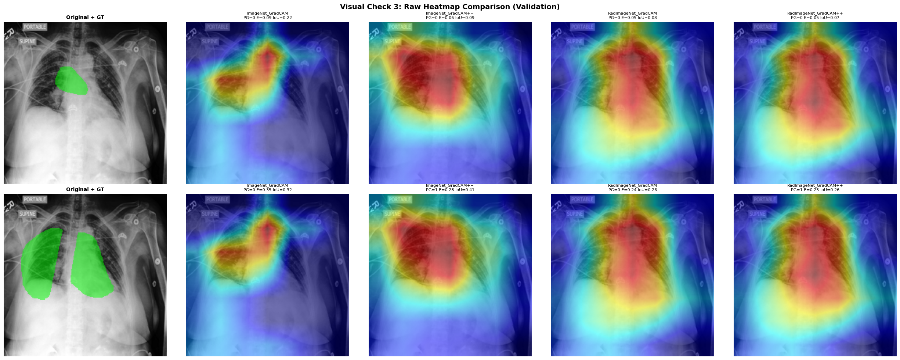
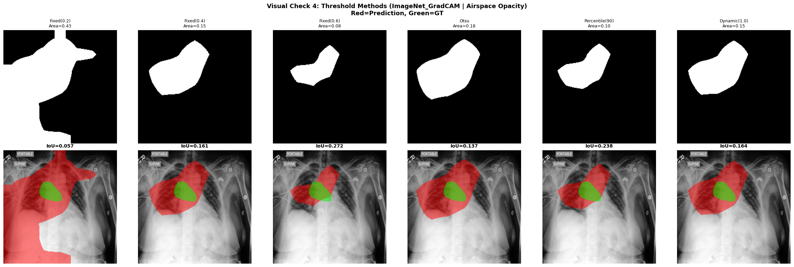
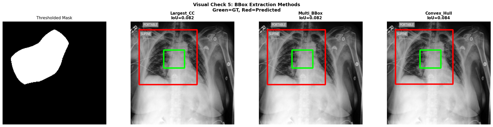
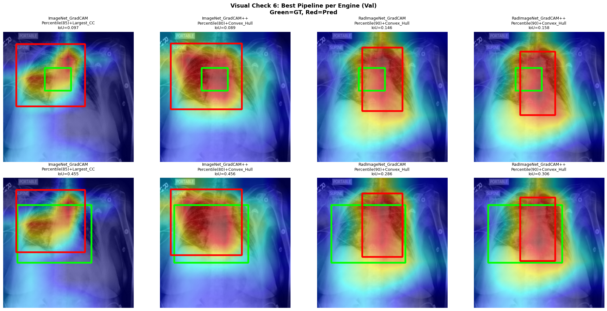
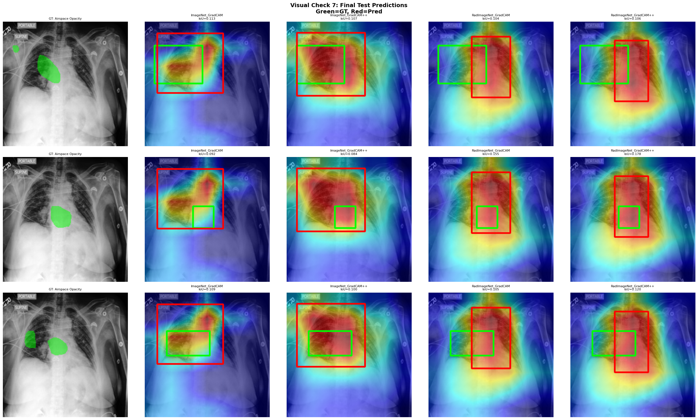
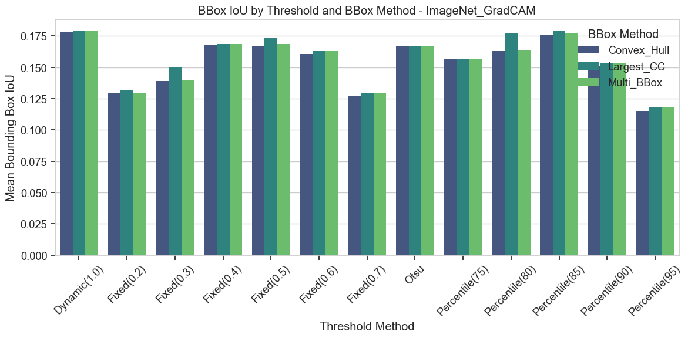
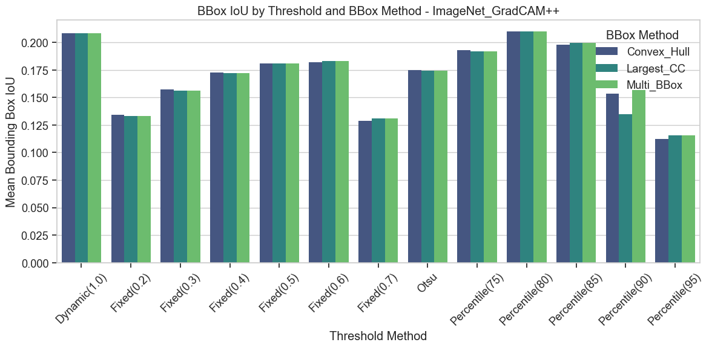

  <h1>Comparative XAI Study: ImageNet vs. RadImageNet Pre-training</h1>
  
<b>An Explainable AI (XAI) analysis comparing DenseNet-121 architectures on the CheXpert dataset.</b>

 

## Project Overview

This repository contains a comprehensive deep learning pipeline to train, evaluate, and interpret multi-label chest X-ray classification models. The primary objective is to investigate how **domain-specific pre-training** (RadImageNet) compares against **general-domain pre-training** (ImageNet) in terms of both traditional classification performance and Explainable AI (XAI) metrics (Bounding Box IoU against human expert annotations).

### Key Research Questions:

- Does radiological pre-training (RadImageNet) yield better classification metrics (AUROC/mAP) than ImageNet?
- Are the heatmaps and bounding boxes generated by models pre-trained on RadImageNet more closely aligned with human expert annotations (CheXlocalize)?
- How do different explainers (Grad-CAM, Grad-CAM++) and thresholding techniques impact interpretability?

---

## Phase 1: Model Training

This phase establishes the baseline classification models.

### Objective

To train two identical deep learning models (**DenseNet-121**) on the CheXpert dataset under the exact same conditions, with the only variable being their **pre-trained initialization weights**.

### Models

1. **DenseImageNet**: Initialized with standard ImageNet weights.
2. **DenseRadImageNet**: Initialized with RadImageNet weights (a large-scale dataset of radiological images).

### Methodology and Training Conditions

Both models were trained using an identical pipeline to ensure a fair comparison:

- **Architecture**: DenseNet-121 (adapted for multi-label classification).
- **Dataset**: CheXpert (resized to 224x224, with CLAHE enhancement).
- **Two-Phase Training Strategy**:
  1. **Specialization Phase**: Uses Asymmetric Loss (ASL) to focus on hard positive cases and handle class imbalance.
  2. **Cooling Phase**: Uses Binary Cross-Entropy (BCE) with per-class positive weights to fine-tune and stabilize the learning process.
- **Hardware Configuration**: Trained using Automatic Mixed Precision (AMP) on CUDA.

---

## Phase 2: Model Evaluation and Testing

This phase evaluates the traditional classification performance metrics of the trained models.

### Objective

To compare the baseline classification performance of the two trained models (DenseImageNet and DenseRadImageNet) on an unseen test set before diving into the interpretability analysis.

### Methodology

- **Test Dataset**: CheXpert holdout test split.
- **Metrics Computed**:
  - **AUROC** (Area Under the Receiver Operating Characteristic curve)
  - **mAP** (Mean Average Precision)
- **Target Classes**: Evaluated across 6 key radiological findings:
  - Airspace Opacity
  - Pleural Effusion
  - Edema
  - Atelectasis
  - Cardiomegaly
  - Enlarged Cardiomediastinum

### Results Summary

Below is the comprehensive analysis dashboard visualizing the comparative performance of both models across the target classes:

  

---

## Phase 3: Explainable AI (XAI) Analysis and Results

This phase forms the core of the study, providing a comprehensive and in-depth analysis of the interpretability of the models.

### Objective

To investigate whether radiological pre-training yields heatmaps and bounding boxes that better align with human expert radiologist annotations compared to general-domain pre-training.

### Detailed XAI Methodology

We applied multiple combinations of explainability algorithms, thresholding techniques, and bounding box extraction methods to the heatmaps generated by the models.

#### 1. Explainability Algorithms (Explainers)

We utilized two gradient-based class activation mapping techniques to generate the raw heatmaps:

- **Grad-CAM**: Uses the gradients of the target concept flowing into the final convolutional layer to produce a coarse localization map.
- **Grad-CAM++**: An extension of Grad-CAM that provides a better visual explanation of CNN model predictions, especially for multiple occurrences of the same class.

#### 2. Thresholding Techniques

To convert continuous heatmaps into binary masks (highlighting the most important regions), we tested a wide array of thresholding methods:

- **Fixed Thresholds**: Absolute values (e.g., 0.2, 0.3, ... 0.7) applied to normalized heatmaps.
- **Percentile Thresholds**: Retaining only the top percentile of activation values (e.g., Top 15% via `Percentile(85)`, `Percentile(90)`, `Percentile(95)`). This method was strictly controlled using an exact Top-K algorithm (`percentile_exact_topk`).
- **Otsu's Method**: An adaptive thresholding technique that minimizes intra-class variance of the black and white pixels.
- **Dynamic Thresholding**: Scaling dynamically based on the maximum activation in the image.
- **Median_Positive Thresholding**: Utilizes the median of positive activations to separate the core pathology region from noise.
- **Youden_J (Oracle)**: An oracle method leveraging ground truth to determine the absolute optimal threshold using Youden's J statistic.

#### 3. Bounding Box Extraction Methods

Once the binary mask was generated, we extracted bounding boxes to compare against the ground truth using three methods:

- **Largest Connected Component (Largest_CC)**: Assumes the pathology is a single contiguous region and isolates the largest blob in the mask.
- **Multiple Bounding Boxes (Multi_BBox)**: Extracts individual bounding boxes for all disjoint activated regions in the mask.
- **Convex Hull**: Computes the smallest convex polygon that encloses all activated regions, producing a single, comprehensive bounding box.

#### 4. Ground Truth and Evaluation Metrics

- **Ground Truth**: We utilized the **CheXlocalize** dataset, which provides expert radiologist bounding box annotations for the CheXpert images.
- **Primary Metric**: **Bounding Box IoU (Intersection over Union)**, which measures the overlap between our extracted bounding boxes and the radiologist's ground truth.
- **Secondary Metrics**: Pixel IoU, Point Game (Hit/Miss), Recall, Precision, and Area Ratio.

### Results and Discussion

#### 1. RadImageNet vs. ImageNet Interpretability

The **RadImageNet-pretrained model consistently outperformed** the ImageNet-pretrained model in localization accuracy (Bounding Box IoU). This indicates that domain-specific pre-training not only aids in classification but significantly improves the model's ability to "look" at the correct anatomical regions when making predictions.

#### 2. Best Performing Pipelines

The optimal configurations found were:

- **ImageNet + Grad-CAM**: Best IoU (~0.179) achieved using **Percentile(85)** thresholding and the **Largest_CC** bounding box method.
- **ImageNet + Grad-CAM++**: Best IoU (~0.210) achieved using **Percentile(80)** thresholding and the **Convex_Hull** bounding box method.
- **RadImageNet + Grad-CAM**: Best IoU (~0.229) achieved using **Percentile(90)** thresholding and the **Convex_Hull** method.
- **RadImageNet + Grad-CAM++**: **Absolute Best Overall IoU (~0.238)** achieved using **Percentile(90)** thresholding and the **Convex_Hull** method.

#### 3. Impact of Algorithms and Hyperparameters

- **Grad-CAM vs. Grad-CAM++**: Grad-CAM++ generally provided tighter and more accurate localizations across both models, leading to higher IoU scores.
- **Thresholding Sensitivity**: The models were highly sensitive to the thresholding technique. **Percentile-based thresholding (between 80th and 90th percentiles)** proved to be the most robust and effective method compared to fixed or Otsu methods.
- **Bounding Box Strategy**: The **Convex_Hull** method proved to be the most reliable for extracting bounding boxes from the heatmaps, as it successfully encapsulated fragmented but related pathological activations without being overly sensitive to noise (like Multi_BBox) or ignoring secondary regions (like Largest_CC).

### Conclusion

The study conclusively demonstrates that transferring weights from a radiologically specific domain (RadImageNet) yields a model that is intrinsically more interpretable and aligned with human clinical reasoning than a model initialized with natural images (ImageNet). Furthermore, utilizing **Grad-CAM++** paired with **high-percentile thresholding** and **Convex Hull bounding box extraction** constitutes the state-of-the-art pipeline for deriving X-ray bounding boxes from classification models.

---

## Visual Samples (Heatmaps and Bounding Boxes)

This section provides visual comparisons of the original X-ray, the Grad-CAM/Grad-CAM++ heatmaps, and the extracted bounding boxes using the optimal pipeline.

### 1. Raw Heatmaps Comparison

**Figure 1:** Comparison of Raw Heatmaps between different explainability algorithms. Evaluates Point Game (PG), Energy (E), and basic IoU.

### 2. Thresholding Methods

**Figure 2:** Visualizing the effect of different threshold methods (Fixed, Otsu, Percentile, Dynamic) on the raw heatmap. Red represents the predicted mask, and Green is the Ground Truth.

### 3. Bounding Box Extraction Methods

**Figure 3:** Comparing how different Bounding Box extraction techniques (Largest_CC, Multi_BBox, Convex_Hull) wrap the thresholded activations. The Green box is the Ground Truth, and Red is the predicted bounding box.

### 4. Best Pipeline per Model

**Figure 4:** Displaying the optimal pipeline (Threshold + BBox method) for each model and algorithm on validation samples.

### 5. Final Test Predictions

**Figure 5:** Final unseen test set predictions comparing ImageNet vs RadImageNet capabilities. RadImageNet visually demonstrates tighter and more accurate bounding boxes compared to standard ImageNet.

### Evaluation Plots

The charts below, generated from the extraction pipelines, show the systematic performance of different configurations:

**Chart 1:** Distribution of BBox IoU across different algorithms and thresholding methods.

**Chart 2:** Boxplots summarizing the impact of the Bounding Box extraction methods.

---

## Datasets and Model Weights

> **Note:** Due to storage constraints, large dataset files and `.pth` model weights are not directly included in this repository.

- **Datasets**:
  - [CheXpert Dataset](https://drive.google.com/file/d/1W2S14FcXtG4SuCLcUVfErBQvW77RGMxm/view?usp=sharing) (For training and testing)
  - [CheXlocalize](https://drive.google.com/file/d/1Atl8PvKRpTxX2vO9qVGqz9Wd89LcDFEw/view?usp=sharing) (For XAI bounding box ground-truth)
  - [PreProcessingCSVs](https://drive.google.com/file/d/1MHwl0pNcPuM5Lo01hQQzeVpknxVH1fWc/view?usp=sharing) (For All MetaData)

- **Our Best custom trained weights can be downloaded from here**:
  - [DensNet121-RadImageNet](https://drive.google.com/file/d/18i4N3XEx4F9hW2fzSLDoL1wD8zsREhR5/view?usp=sharing)
  - [DensNet121-ImageNet](https://drive.google.com/file/d/13DmhlSZBgGX-2DouMIay5XkUL2wsQmPf/view?usp=sharing)

## Requirements and Tech Stack

- **Framework**: PyTorch, Torchvision
- **XAI Libraries**: pytorch-grad-cam
- **Data Processing**: Pandas, NumPy, OpenCV, scikit-image
- **Visualization**: Matplotlib, Seaborn

## How to Run

1. Clone the repository.
2. Navigate to the `Training/` directory to review the model pipelines.
3. Check `Testing/` for baseline metric computation.
4. Run the notebooks in `xai_results/` to reproduce the interpretability analysis.
