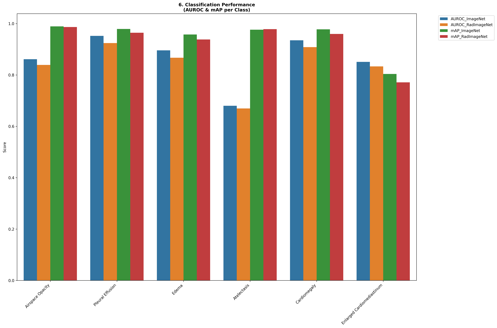

# Phase 2: Model Evaluation & Testing

This directory contains the testing pipeline and the traditional classification performance metrics of the trained models.

## 🎯 Objective
To evaluate and compare the baseline classification performance of the two trained models (**DenseImageNet** and **DenseRadImageNet**) on an unseen test set before diving into interpretability analysis.

## 🧪 Methodology
- **Test Dataset**: CheXpert holdout test split.
- **Metrics Computed**: 
  - **AUROC** (Area Under the Receiver Operating Characteristic curve)
  - **mAP** (Mean Average Precision)
- **Target Classes**: Evaluated across 6 key radiological findings:
  - Airspace Opacity
  - Pleural Effusion
  - Edema
  - Atelectasis
  - Cardiomegaly
  - Enlarged Cardiomediastinum

## 📊 Results Summary
The numerical results of the evaluation are stored in [`classification_performance.csv`](./classification_performance.csv). 

Below is the comprehensive analysis dashboard visualizing the comparative performance of both models across the target classes:

## 📂 Files Included
- `Testing.ipynb`: The Jupyter notebook containing the full evaluation pipeline, data loading, and metric computation.
- `classification_performance.csv`: Raw tabular results.
- `comprehensive_analysis_dashboard.png`: Visual bar-charts comparing AUROC and mAP scores.
